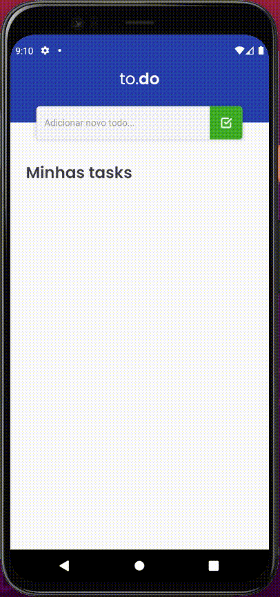

# Desafio 1 - Bootcamp Ignite - Rocketseat

<h1 align="center">
  to.do
</h1>

 

  

## ✨ Tecnologias

Para tornar esse projeto funcional, foram utilizadas as seguintes tecnologias:

- React Native
- Typescript
- Javascript

## 💻 Projeto

Aplicativo de tarefas. É possível adicionar tarefas, marcá-las como concluídas e deletá-las.

## 🚀 Como executar

Para executar o app, basta seguir os passos descritos em: https://reactnative.dev/docs/environment-setup. Assim que tiver o ambiente 
configurado:
- Execute o emulador do Android Studio
- Vá até a pasta do projeto
- Execute os comandos `yarn start` e depois `yarn android` no terminal
